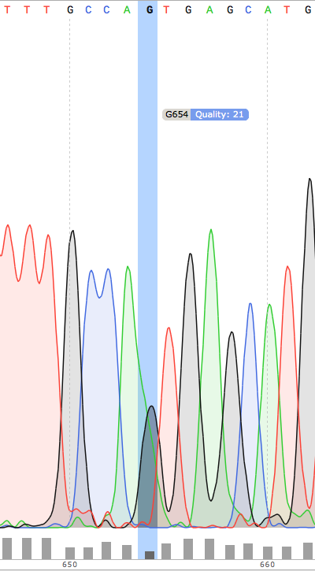

- [Structure](#sec-1)
- [Commentaires](#sec-2)
  - [<span class="timestamp-wrapper"><span class="timestamp">[2015-11-09 Mon]</span></span>](#sec-2-1)
  - [<span class="timestamp-wrapper"><span class="timestamp">[2015-11-16 Mon]</span></span>](#sec-2-2)
  - [<span class="timestamp-wrapper"><span class="timestamp">[2015-11-17 Tue]</span></span>](#sec-2-3)
  - [<span class="timestamp-wrapper"><span class="timestamp">[2015-11-18 Wed]</span></span>](#sec-2-4)
  - [<span class="timestamp-wrapper"><span class="timestamp">[2015-11-20 Fri]</span></span>](#sec-2-5)
  - [<span class="timestamp-wrapper"><span class="timestamp">[2015-11-28 Sat]</span></span>](#sec-2-6)
  - [<span class="timestamp-wrapper"><span class="timestamp">[2015-12-03 Thu]</span></span>](#sec-2-7)
- [Scripts](#sec-3)
  - [Première version](#sec-3-1)
    - [Extraction des données brutes](#sec-3-1-1)
    - [Des spectrogrammes aux données fastq non-trimmées](#sec-3-1-2)
      - [prérequis](#sec-3-1-2-1)
      - [via seqret](#sec-3-1-2-2)
    - [Des données non-trimmées aux données trimmées et filtrées](#sec-3-1-3)
    - [Analyse de la qualité des séquences](#sec-3-1-4)
    - [Détermination des SNP](#sec-3-1-5)
    - [Analyse des variants](#sec-3-1-6)
      - [Lecture des données et nettoyage](#sec-3-1-6-1)
      - [Détermine la qualité des SNP](#sec-3-1-6-2)
      - [Graphiques globaux](#sec-3-1-6-3)
      - [Observations globales](#sec-3-1-6-4)
      - [Détermination des SNP calibrés <code>[2/2]</code>](#sec-3-1-6-5)
      - [Positions terminales de switch <code>[1/3]</code>](#sec-3-1-6-6)
      - [SNP inattendus <code>[1/1]</code>](#sec-3-1-6-7)
      - [Position des SNP par rapport à la conversion tract <code>[1/1]</code>](#sec-3-1-6-8)
      - [Polymorphisme <code>[1/2]</code>](#sec-3-1-6-9)
  - [Deuxième version](#sec-3-2)
    - [Base calling](#sec-3-2-1)
    - [Alignement](#sec-3-2-2)
    - [Pooling](#sec-3-2-3)
    - [Sens des mutations](#sec-3-2-4)
    - [Analyses](#sec-3-2-5)
- [Script Principal](#sec-4)
- [configuration](#sec-5)

```emacs-lisp
(org-babel-tangle-file "README.org")
```

Le dossier contient les données du séquençage des deux plaques envoyées à la
suite des manips de Florence. 

# Structure<a id="orgheadline1"></a>

```sh
tree ./ -L 2
```

<table border="2" cellspacing="0" cellpadding="6" rules="groups" frame="hsides">


<colgroup>
<col  class="org-left" />

<col  class="org-left" />

<col  class="org-left" />
</colgroup>
<thead>
<tr>
<th scope="col" class="org-left">dossier</th>
<th scope="col" class="org-left">fichier ou dossier</th>
<th scope="col" class="org-left">description</th>
</tr>
</thead>

<tbody>
<tr>
<td class="org-left">analysis</td>
<td class="org-left">&#xa0;</td>
<td class="org-left">&#xa0;</td>
</tr>


<tr>
<td class="org-left">&#xa0;</td>
<td class="org-left">&#x2013; plots</td>
<td class="org-left">dossier contenant les différents plots générés par plots-bcftools.</td>
</tr>


<tr>
<td class="org-left">&#xa0;</td>
<td class="org-left">&#x2013; snp<sub>distribution.pdf</sub></td>
<td class="org-left">la distribution des SNP sans tenir compte de la provenance des mutants</td>
</tr>


<tr>
<td class="org-left">&#xa0;</td>
<td class="org-left">&#x2013; snp<sub>resume.pdf</sub></td>
<td class="org-left">les trois plots sur la même feuille</td>
</tr>


<tr>
<td class="org-left">&#xa0;</td>
<td class="org-left">&#x2013; substitution<sub>distribution.pdf</sub></td>
<td class="org-left">la distribution des substitutions.</td>
</tr>


<tr>
<td class="org-left">&#xa0;</td>
<td class="org-left">&#x2013; trimmed<sub>fastqc.html</sub></td>
<td class="org-left">le contrôle de la qualité des séquences trimmées via fastqc</td>
</tr>


<tr>
<td class="org-left">&#xa0;</td>
<td class="org-left">&#x2013; untrimmed<sub>fastqc.html</sub></td>
<td class="org-left">le contrôle de la qualité des séquences non-trimmées via fastqc</td>
</tr>


<tr>
<td class="org-left">&#xa0;</td>
<td class="org-left">&#x2013; vincent<sub>plot.pdf</sub></td>
<td class="org-left">le graphe de vincent le jour de la réception des données.</td>
</tr>


<tr>
<td class="org-left">&#xa0;</td>
<td class="org-left">&#x2013; Analysis<sub>Summary</sub>-Sanger<sub>Pipeline.pdf</sub></td>
<td class="org-left">description du fichier d'analyse GATK</td>
</tr>
</tbody>

<tbody>
<tr>
<td class="org-left">data</td>
<td class="org-left">&#xa0;</td>
<td class="org-left">&#xa0;</td>
</tr>


<tr>
<td class="org-left">&#xa0;</td>
<td class="org-left">&#x2013; 1369607.INDEL.csv</td>
<td class="org-left">le fichier envoyé par GATK</td>
</tr>


<tr>
<td class="org-left">&#xa0;</td>
<td class="org-left">&#x2013; 1369607.SNP.csv</td>
<td class="org-left">le fichier envoyé par GATK</td>
</tr>


<tr>
<td class="org-left">&#xa0;</td>
<td class="org-left">&#x2013; 1369628.INDEL.csv</td>
<td class="org-left">le fichier envoyé par GATK</td>
</tr>


<tr>
<td class="org-left">&#xa0;</td>
<td class="org-left">&#x2013; 1369628.SNP.csv</td>
<td class="org-left">le fichier envoyé par GATK</td>
</tr>


<tr>
<td class="org-left">&#xa0;</td>
<td class="org-left">&#x2013; all.fasta</td>
<td class="org-left">toutes les séquences</td>
</tr>


<tr>
<td class="org-left">&#xa0;</td>
<td class="org-left">&#x2013; fasta</td>
<td class="org-left">dossier contenant les séquences une à une</td>
</tr>


<tr>
<td class="org-left">&#xa0;</td>
<td class="org-left">&#x2013; fastq</td>
<td class="org-left">idem en fastq</td>
</tr>


<tr>
<td class="org-left">&#xa0;</td>
<td class="org-left">&#x2013; id<sub>table.dat</sub></td>
<td class="org-left">une table contenant les nom de séquence, le mutant, et la qualité du mutant</td>
</tr>


<tr>
<td class="org-left">&#xa0;</td>
<td class="org-left">&#x2013; raw<sub>seq</sub><sub>nvbr</sub></td>
<td class="org-left">le dossier contenant les données brutes. NEPASTOUCHER</td>
</tr>


<tr>
<td class="org-left">&#xa0;</td>
<td class="org-left">&#x2013; reference.fasta</td>
<td class="org-left">la séquence de référence</td>
</tr>


<tr>
<td class="org-left">&#xa0;</td>
<td class="org-left">&#x2013; refseq.fasta</td>
<td class="org-left">idem</td>
</tr>


<tr>
<td class="org-left">&#xa0;</td>
<td class="org-left">&#x2013; refseq<sub>reverse.fasta</sub></td>
<td class="org-left">la séquence de référence reversed.</td>
</tr>


<tr>
<td class="org-left">&#xa0;</td>
<td class="org-left">&#x2013; seq</td>
<td class="org-left">le dossier contentant les séquneces</td>
</tr>


<tr>
<td class="org-left">&#xa0;</td>
<td class="org-left">&#x2013; spectrograms</td>
<td class="org-left">le dossier contentant les .ab1 files</td>
</tr>


<tr>
<td class="org-left">&#xa0;</td>
<td class="org-left">&#x2013; tmp</td>
<td class="org-left">un dossier de travail</td>
</tr>


<tr>
<td class="org-left">&#xa0;</td>
<td class="org-left">&#x2013; trimmed.fasta</td>
<td class="org-left">les séquences trimmées</td>
</tr>


<tr>
<td class="org-left">&#xa0;</td>
<td class="org-left">&#x2013; trimmed.fastq</td>
<td class="org-left">idem</td>
</tr>


<tr>
<td class="org-left">&#xa0;</td>
<td class="org-left">&#x2013; untrimmed.fastq</td>
<td class="org-left">les séquences non trimmées</td>
</tr>


<tr>
<td class="org-left">&#xa0;</td>
<td class="org-left">&#x2013; variantCalling</td>
<td class="org-left">le dossier de travail pour l'analyse des variants</td>
</tr>
</tbody>

<tbody>
<tr>
<td class="org-left">scripts</td>
<td class="org-left">&#xa0;</td>
<td class="org-left">&#xa0;</td>
</tr>


<tr>
<td class="org-left">&#xa0;</td>
<td class="org-left">&#x2013; ab1<sub>parser.py</sub></td>
<td class="org-left">convertit l'ensemble des fichiers .ab1 en fastq</td>
</tr>


<tr>
<td class="org-left">&#xa0;</td>
<td class="org-left">&#x2013; ab1<sub>to</sub><sub>fastq</sub></td>
<td class="org-left">idem, utilitaire pipeable</td>
</tr>


<tr>
<td class="org-left">&#xa0;</td>
<td class="org-left">&#x2013; exploratory<sub>analysis.R</sub></td>
<td class="org-left">premières analyses dans R</td>
</tr>


<tr>
<td class="org-left">&#xa0;</td>
<td class="org-left">&#x2013; extract<sub>raw</sub><sub>data.sh</sub></td>
<td class="org-left">met en place la structure de données</td>
</tr>


<tr>
<td class="org-left">&#xa0;</td>
<td class="org-left">&#x2013; make<sub>id</sub><sub>table.py</sub></td>
<td class="org-left">crée le fichier ../data/id<sub>table.dat</sub></td>
</tr>


<tr>
<td class="org-left">&#xa0;</td>
<td class="org-left">&#x2013; quality<sub>check</sub></td>
<td class="org-left">analyse la qualité via fastqc</td>
</tr>


<tr>
<td class="org-left">&#xa0;</td>
<td class="org-left">&#x2013; trim<sub>low</sub><sub>quality.sh</sub></td>
<td class="org-left">trimme les séquences via bbduk</td>
</tr>


<tr>
<td class="org-left">&#xa0;</td>
<td class="org-left">&#x2013; variantCallerBwa.sh</td>
<td class="org-left">un premier essai d'alignement et de snp calling via samtools et bcftools</td>
</tr>


<tr>
<td class="org-left">&#xa0;</td>
<td class="org-left">&#x2013; variantCallerSsaha2.sh</td>
<td class="org-left">l'alignement avec ssaha2SNP</td>
</tr>


<tr>
<td class="org-left">&#xa0;</td>
<td class="org-left">&#x2013; variant<sub>analysis.R</sub></td>
<td class="org-left">l'analyse des variants et les graphes qui vont avec</td>
</tr>
</tbody>
</table>

# Commentaires<a id="orgheadline9"></a>

## <span class="timestamp-wrapper"><span class="timestamp">[2015-11-09 Mon]</span></span><a id="orgheadline2"></a>

Pas de données dans le fichier <./data/fasta/pS6-1073.fas>, mais pourtant le
fichier <./data/spectrograms/pS6-1073.ab1> en contient. On repart des .ab1 avec un
script <./scripts/ab1_parser.py>, qui convertit les .ab1 en fasta et fastq. 

Le fichier <./data/fasta/pS6-1073.fst> est toujours aussi mauvais. Erreurs de
séquençage ? À exclure des analyses. 

Le fichier <./data/fasta/pS9-1073.fst> a un indel en position 343-342 et en
position 397. Au vu du spectrogramme <./data/spectrograms/pS9-1073.ab1>, c'est une
erreur de séquençage. Globalement, qualité du séquençage pas très bonne. À
exclure des analyses.

## <span class="timestamp-wrapper"><span class="timestamp">[2015-11-16 Mon]</span></span><a id="orgheadline3"></a>

La semaine dernière, le script <./scripts/ab1_parser.py> convertissait tous les
spectrograms de `ab1` vers `fastq`. Combiné en 1 fichier, `all.fastq`, on a
utilisé *fastqc* pour avoir une idée de la qualité. Le résultat dans
<./analysis/all_fastqc.html>. Il a été convenu arbitrairement avec Vincent que les bases d'une
qualité < 28 seraient exclues de l'analyse. Aujourd'hui, le script
<./scripts/ab1_parser.py> va être modifié en conséquence. Voir les anciennes
versions via *git* éventuellement.

J'écris également aujourd'hui le script <./scripts/trim_low_quality.py>, qui
enlève les 30 premières et dernières séquences, et qui empêche les séquences de
trop mauvaise qualité d'être utilisées dans l'analyse. 

Finalement, inutile de réinventer la roue. `Fastx_toolkit` devrait normalement
faire ça très bien, mais ça ne fonctionne pas, pour des raisons que je ne
m'explique pas. Cependant, je suis tombé sur l'utilitaire `BBmap`, qui contient
entre autre, `bbduk`. [Voir le fichier source ici](file:///Users/samuelbarreto/.bin/bbmap/bbduk.sh), la page de téléchargement [là](http://sourceforge.net/projects/bbmap/?source=typ_redirect),
et pour des commentaires sur l'utilisation [Voir là](http://seqanswers.com/forums/showthread.php?t=58221), et [là](http://seqanswers.com/forums/showthread.php?t=42776).

## <span class="timestamp-wrapper"><span class="timestamp">[2015-11-17 Tue]</span></span><a id="orgheadline4"></a>

Je supprime donc le script `low_quality_trim.py`. J'utilise le script
`low_quality_trim.sh`. 

En résultat, comparer <./analysis/trimmed_fastqc.html> et
<./analysis/untrimmed_fastqc.html>. On n'a plus que 179 séquences au lieu de 192,
mais ça vaut le coup, la qualité est largement supérieure. 

Je veux maintenant déterminer les SNPs. Il faut donc que j'aligne les séquences
obtenues avec la séquence de référence <./data/refseq.fasta>. GATC utilise le
software `SSAHA2` (voir [là](http://www.sanger.ac.uk/science/tools/ssaha2-0)) mais à priori il n'est plus utilisable. Le site
recommande d'utiliser `SMALT`, (voir la page de téléchargement [là](http://sourceforge.net/projects/smalt/?source=typ_redirect), le manuel [là](ftp://ftp.sanger.ac.uk/pub/resources/software/smalt/smalt-manual-0.7.4.pdf)
et la page du software [là](http://www.sanger.ac.uk/science/tools/smalt-0). 

En fait, je l'ai juste installé comme ça :

```sh
brew update
brew tap homebrew/homebrew-science
brew install smalt
```

Finalement, c'est encore un autre workflow que je veux adopter. On repart sur
`ssaha2` et `ssaha2SNP`, la page de téléchargement étant
<ftp://ftp.sanger.ac.uk/pub/resources/software/ssaha2/>.  

## <span class="timestamp-wrapper"><span class="timestamp">[2015-11-18 Wed]</span></span><a id="orgheadline5"></a>

Il faut clarifier les étapes permettant d'aligner et de déterminer les SNP. Ce
qui est fait dans le script <./scripts/variantCallerSsaha2.sh>. 

## <span class="timestamp-wrapper"><span class="timestamp">[2015-11-20 Fri]</span></span><a id="orgheadline6"></a>

Le rapport était basé sur une version de ma fonction `mutant_caller` dans le
script R <./scripts/variant_analysis.R> qui était fausse. Très fausse. Beaucoup de
boulot à corriger. 

## <span class="timestamp-wrapper"><span class="timestamp">[2015-11-28 Sat]</span></span><a id="orgheadline7"></a>

La photo suivante montre le spectrogramme d'une position appelée N dans les
alignements. Pour moi c'est la marque de l'hétérogénéité dans la colonie. Les
uns réparent en G, les autres en A ou T.

 

## <span class="timestamp-wrapper"><span class="timestamp">[2015-12-03 Thu]</span></span><a id="orgheadline8"></a>

J'ai cherché à extraire les données trace par trace, mais à priori il n'y a pas
d'OSS qui permette de faire ça. On va donc utiliser la qualité comme proxy du
polymorphisme. Ça implique de baisser le seuil d'exigence quant aux bases qu'on
décide de renommer `N`. Donc modification du script 

# Scripts<a id="orgheadline36"></a>

## Première version<a id="orgheadline29"></a>

Contient les différents scripts nécessaires pour aboutir aux contenus
d'`analysis`. 

### Extraction des données brutes<a id="orgheadline10"></a>

Pour extraire les données du fichier brut .zip à la structure de données.

```sh
#!/bin/bash 

cd ~/stage/seq_novembre/
# Le script qui extrait les données depuis les fichiers zip bruts et qui met en
# place la structure de fichier.

cd ./data
## extraction des données brutes
unzip raw_seq_nvbr/1369607.zip
unzip raw_seq_nvbr/1369628.zip

## crée les dossiers
mkdir fasta seq spectrograms csv
## déplace tout les fichiers dans des dossiers adaptés 
find . -name "*.fas" -exec mv -i {} -t ./fasta/ \;
find . -name "*.ab1" -exec mv -i {} -t ./spectrograms/ \;
find . -name "*.seq" -exec mv -i {} -t ./seq/ \;
find . -name "*.csv" -exec mv -i {} -t ./csv/ \;

# déplace le contenu du dossier inutile dans le présent dossier
mv 1369628/* ./
rm -r 1369628 # supprime le dossier
# déplace le fichier pdf dans le dossier adapté
mv *.pdf ../analysis
```

Les spectrogrammes contiennent l'info de la sequence<sub>id</sub> et du nom. 
On construit une table avec la qualité du mutant en troisième colonne. 

```python
from Bio import SeqIO
import glob

def strong_or_weak(record):
    """
    Determine si le mutant est strong ou weak
    """
    if 'S' in record:
        return 'strong'
    else:
        return 'weak'

# en-tete de colonne
print "id name mutant"

# pour chaque fichier ab1
for file in glob.glob("../data/spectrograms/*.ab1"):
    with open(file, "rb") as spectro:
        for record in SeqIO.parse(spectro, "abi"):
            # associer l'id avec le nom et le type de mutant
            print record.id + " " + record.name + \
                " " + strong_or_weak(record.name)
```

On crée la table en question via :

```sh
cd ~/stage/seq_novembre/scripts
python make_id_table.py > ../data/id_table.dat
```

### Des spectrogrammes aux données fastq non-trimmées<a id="orgheadline13"></a>

#### prérequis<a id="orgheadline11"></a>

```sh
brew install emboss
```

#### via seqret<a id="orgheadline12"></a>

```sh
cd ~/stage/seq_novembre/scripts

touch untrimmed.fastq
for file in ../data/spectrograms/*.ab1
do
    seqret \
        -sformat abi \
        -osformat fastq \
        -auto \
        -stdout \
        -sequence $file \
        >> ../data/untrimmed.fastq
done

## convertit le fastq en fasta
seqret -sformat fastq -osformat fasta -auto -stdout \
       -sequence ../data/untrimmed.fastq > ../data/untrimmed.fasta
```

### Des données non-trimmées aux données trimmées et filtrées<a id="orgheadline14"></a>

Un script qui convertit le fichier <./data/untrimmed.fastq> en fichier
<./data/trimmed.fastq>. *bbduk* trimme les bases de faible qualité. seqtk
convertit les bases restantes de faible qualité en N, seqret convertit le fastq
généré en fasta. 

```sh
#!/usr/local/bin/bash

#' -qtrim=rl : quality trim right and left 
#' -trimq=28 : trim if quality < 28 (sanger encoding, illumina 1.9)
#' -minlen=620 : keep only seq with length > 620, after trimming.
#' -Xmx1g : tells bbduk / java to use 1G of RAM

if [[ -f ../data/untrimmed.fastq && ! -f ../data/trim.fastq ]]
then # si les fichiers n'existent pas.
    ~/.bin/bbmap/bbduk.sh -Xmx1g \
                          -in=../data/untrimmed.fastq \
                          -out=../data/trim.fastq \
                          -qtrim=rl \
                          -trimq=28 \
                          -minlen=620

    ## convertit les bases d'une qualité inférieure à 20 en N.
    seqtk seq -q20 -nN ../data/trim.fastq > ../data/trimmed.fastq

    ## convertit le fastq en fasta
    seqret -sformat fastq -osformat fasta -auto -stdout \
           -sequence ../data/trimmed.fastq > ../data/trimmed.fasta

    rm ../data/trim.fastq
else
    printf "Le fichier untrimmed.fastq n'existe pas, ou le fichier trimmed.fastq existe déjà."
fi
```

### Analyse de la qualité des séquences<a id="orgheadline15"></a>

Le script utilisé pour analyser les données de qualité via *fastqc*. 

```sh
#!/usr/local/bin/bash
cd ~/stage/seq_novembre/scripts

# quand dans le dossier ./scripts
cd ../data/

if [ -f untrimmed.fastq ] && [ -f trimmed.fastq ] ; then
    mkdir tmp
    # analyse les données et output dans tmp
    fastqc untrimmed.fastq -o ./tmp
    fastqc trimmed.fastq   -o ./tmp
    # unzip resulting files
    unzip -qq tmp/untrimmed_fastqc.zip -d tmp
    unzip -qq tmp/trimmed_fastqc.zip -d tmp
    # extract main results
    mv tmp/untrimmed_fastqc/Images/per_base_quality.png \
       ../analysis/per_base_quality_fastqc_untrimmed.png
    mv tmp/trimmed_fastqc/Images/per_base_quality.png \
       ../analysis/per_base_quality_fastqc_trimmed.png
    # copy html into analysis
    mv tmp/*.html ../analysis/
    # delete tmp files
    rm -r tmp # remove temporary files

else
    printf "Les fichiers untrimmed.fastq et trimmed.fastq n'existent pas."
fi
```

### Détermination des SNP<a id="orgheadline16"></a>

```sh
#!/bin/bash
# variant calling using ssaha2 and ssaha2SNP

cd ~/stage/seq_novembre/data
## prend le reverse complement de la séquence de référence
fastx_reverse_complement -i reference.fasta -o reference_reverse.fasta

mkdir variantCalling
cd variantCalling

## place les séquences nécessaires pour l'analyse dans le dossier. 
ln -s ../trimmed.fastq .
ln -s ../reference_reverse.fasta ./reference_reverse.fasta

## alignement à la séquence de référence
#' -output psl :             format de sortie psl
#' reference_reverse.fasta : séquence de référence
#' trimmed.fastq :           séquence à aligner
#' output.psl :              fichier de sortie
~/.bin/ssahaSNP/ssaha2 -output psl reference_reverse.fasta trimmed.fastq > output.psl

## polymorphism detection tool
~/.bin/ssahaSNP/ssahaSNP reference_reverse.fasta trimmed.fastq > SNP.txt

## computer readable format conversion
# egrep trouve les lignes où sont indiquées les données concernant les SNP
# awk extrait les champs en question dans un fichier SNP.dat
egrep ssaha:SNP SNP.txt | \
    awk '{print $1,$2,$3,$4,$5,$6,$7,$8,$9,$10,$11,$12,$13,$14,$15}' > SNP.dat

## column annotation based on
## ftp://ftp.sanger.ac.uk/pub/resources/software/ssahasnp/readme,
## part (6) some further information
# la première ligne du fichier .dat, afin d'être lu dans R
echo " match subject_name index_of_subject read_name s_base q_base s_qual q_qual offset_on_subject offset_on_read length_of_snp start_match_of_read end_match_of_read match_direction length_of_subject " > head.dat
# into final document
cat head.dat SNP.dat > snp_calling.dat
```

### Analyse des variants<a id="orgheadline28"></a>

#### Lecture des données et nettoyage<a id="orgheadline17"></a>

Le fichier <file:///Users/samuelbarreto/stage/seq_novembre/data/variantCalling/snp_calling.dat> contient les
données d'intérêt. Il ne contient ni le nom du transformant, ni son type (Weak
ou Strong). Les données sont récupérées dans le fichier <./data/id_table.dat>. Les
deux tables sont associés via un *inner<sub>join</sub>*. 

On s'est rendu compte que le plasmide `pS60` était un contaminant, toutes les
mutations qu'il engendre sont de type *weak*. Il est donc rebasculé dans le
tableau des Weak. 

```R
setwd("~/stage/seq_novembre/data/variantCalling")

library(dplyr)

## read the data
snp <- tbl_df(read.table("snp_calling.dat", head = TRUE))
## enlève les colonnes inutiles
snp %>%
    select(
        -match, -subject_name, -index_of_subject, -length_of_subject,
        -match_direction, -contains("_of_read"), -contains("on_read"),
        -contains("_of_snp"), -s_qual
    ) -> snp

## lit les métadonnées de séquence
id_table <- tbl_df(read.table("../id_table.dat", head = TRUE))

## fait correspondre le read_name avec le nom du clone et le type de mutant W ou S
snp <- inner_join(x = snp, y = id_table, by = c("read_name" = "id"))

## suppress tmp var
rm(id_table)

## bascule les contaminants mysterieux dans la bonne catégorie
## TESTE ET APPROUVE
snp$mutant[snp$name == "pS60-1073"] <- "weak"
snp$mutant[snp$name == "pS83-1073"] <- "weak"
snp$mutant[snp$name == "pS92-1073"] <- "weak"
snp$mutant[snp$name == "pS91-1073"] <- "weak"
snp$mutant[snp$name == "pW6-1073" ] <- "strong"
```

#### Détermine la qualité des SNP<a id="orgheadline18"></a>

Pour déterminer si le SNP est de type *weak* ou *strong*, j'utilise la fonction
`mutant_caller`. Si la référence est A ou T, soit le transformant est C ou G, et
la substitution est *WS* ; soit le transformant est A ou T, et la mutation est
*WW*. Si la référence est C ou G, soit le transformant est A ou T, et la
substitution est *SW* ; soit le transformant est G ou C, la substitution est
*SS*.

```R
#' une fonction pour déterminer si la substitution est strong ou weak. On peut
#' avoir des substitutions weak chez les strongs
#' @param subject la base sur la séquence de référence
#' @param query la base sur le read.
mutant_caller <- function(subject, query)
{
    if (subject == 'A' || subject == 'T') {
        if (query == 'C' || query == 'G' ) {
            'WS'
        } else {
            'WW'
        }
    } else if (subject == 'C' || subject == 'G') {
        if (query == 'A' || query == 'T') {
            'SW'
        } else {
            'SS'
        }
    }
}

## on applique la fonction rowwise, ie ligne par ligne, via `mutate`, puis on
## dégroupe.
snp %>%
    rowwise() %>%
    mutate(mutation_type = mutant_caller(s_base, q_base)) %>%
    ungroup() ->
    snp
## conversion en facteur
snp$mutation_type = factor(snp$mutation_type)
```

#### Graphiques globaux<a id="orgheadline19"></a>

Des graphiques de distribution globale des SNP sont fait ici. 

```R
##==============================================================================
## SHORTCUT PLOT FUNCTION
##==============================================================================

library(ggplot2)

##' .. content for \description{} (no empty lines) ..
##' 
##' Une fonction qui permet de court-circuiter ggplot : représente en ordonnée
##' la distribution des positions de snp, en abscisse la position des SNPs, par
##' défault la couleur repéresente le type de mutant, peut être également
##' attribuée à mutation_type. Respecte les critères visuels de tufte. Nécessite
##' ggplot2 1.02 si je ne m'abuse, avec l'option panel.ontop en tout cas.
##' 
##' .. content for \details{} ..
##' @title plot_snp
##' @param snp les données de snp
##' @param fill la couleur par laquelle on color les barres
##' @param legend_position la position de la légende sur le graphe
##' @param legend_name le titre de la légende. rien par défault
##' @return un graphique
##' @author Samuel Barreto
plot_snp <- function(data, fill_by = "mutant",
                                  legend_position = c(0.2, 0.8),
                                  legend_name = "")
{
    plot <- ggplot(data = data, aes(offset_on_subject)) +
        theme_minimal(base_family = "Courier") +
        scale_x_continuous(breaks = seq(1, 734, 30)) +
        scale_fill_brewer(palette = "Set2", name = legend_name) +
        xlab("") +
        ylab("") +
        theme(panel.ontop = TRUE, legend.position = legend_position,
              axis.text = element_text(size = 8, colour = "gray"),
              panel.grid.major.x = element_blank(),
              panel.grid.minor.x = element_blank(),
              panel.grid.minor.y = element_blank(),
              panel.grid.major.y = element_line(colour = "white", size = 1))

    if (fill_by == "mutation_type")
    {
        plot + geom_histogram(aes(fill = mutation_type), binwidth = 10,
                              position = "dodge")
    } else {
        plot + geom_histogram(aes(fill = mutant), binwidth = 10,
                              position = "dodge")
    }
}

##==============================================================================
## PLOT DISTRIBUTIONS
##==============================================================================

pdf(file = "../../analysis/snp_distribution.pdf", height = 5.8, width = 8.3)

## distribution des SNP
## facétée par type de mutant, couleur = type de mutation
snp %>%
    plot_snp(legend_name = "Exogene", legend_pos= c(.2, .8))

dev.off()

#-------------------------------------------------------------------------------
pdf(file = "../../analysis/mutant_snp_distribution.pdf", height = 5.8, width = 8.3)

snp %>%
    plot_snp(fill_by = "mutation_type", legend_name = "Type de Mutation" ) +
    facet_grid(mutant ~ .)

dev.off()
```

#### Observations globales<a id="orgheadline20"></a>

Différents tableaux de résumé généraux. 

```R
## =============================================================================
## OBSERVATIONS GÉNÉRALES
## =============================================================================

sink(file = "../../analysis/observations.tex")
snp %>%
    group_by(mutant, name) %>%
    summarise(count = n()) %>%
    summarise(mean = mean(count), med = median(count), sd = sd(count) ) %>%
    knitr::kable( align = 'c', digits = 2, booktabs = TRUE, format = "latex")
sink()

sink(file = "../../analysis/count_by_mutant.tex")
snp %>%
    group_by(mutant) %>%
    summarise(count = n()) %>%
    knitr::kable( align = 'c', booktabs = TRUE, format = "latex")
sink()

sink(file = "../../analysis/count_by_muttype.tex")
snp %>%
    group_by(mutation_type) %>%
    summarise(count = n()) %>%
    knitr::kable(col.names = c("Type de mutation", "nombre"),
                 align = 'c',
                 booktabs = TRUE, format = "latex")
sink()

sink(file = "../../analysis/seq_by_mutant.tex")
distinct(snp, name, mutant) %>%
    group_by(mutant) %>%
    summarise(count = n()) %>%
    knitr::kable( align = 'c', booktabs = TRUE, format = "latex")
sink()
```

#### Détermination des SNP calibrés <code>[2/2]</code><a id="orgheadline21"></a>

-   [X] créer la fonction `is_a_position` qui détermine si un SNP est bien à la
    position attendu
-   [X] faire la même chose par type de mutant

On veut filtrer les positions qui sont bien les SNP calibrés. 

```R
## ==============================================================================
## SNP ATTENDUS OU NON
## ==============================================================================
##

## compte le nombre de SNP par position. hypothèse : un SNP `calibré' génère au
## moins 5 SNP parmi toutes les séquences. sortie dans une table qui sert de
## query à la fonction =is_position=
snp %>%
    group_by(offset_on_subject) %>%
    summarise(count = n()) %>%
    ## qplot(data = ., offset_on_subject, count)
    filter(count > 5) %>%
    select(offset_on_subject) %>%
    unlist() %>%
    as.vector() ->
    position_table

##' .. content for \description{} (no empty lines) ..
##' détermine si la postion sur la séquence de référence est un SNP artificiel
##' ou un autre genre de SNP.
##' .. content for \details{} ..
##' @title is_position
##' @param position 
##' @param table 
##' @return "oui" ou "non"
##' @author Samuel Barreto
is_position <- function(position, table)
{
    ifelse(position %in% table, 'oui', 'non')
}

snp %>%
    rowwise() %>%
    mutate(position = is_position(offset_on_subject, position_table)) %>%
    ungroup() ->
    snp

## gros résultat là.
## on voit seulement 3 mutations S->W contre 12 W->S !
pdf(file = "../../analysis/bgc_en_action.pdf", height = 5.8, width = 8.3)
snp %>%
    filter(position == "non") %>%
    plot_snp(fill_by = "mutation_type") +
    scale_y_continuous(breaks = c(1, 2)) +
    scale_x_continuous(breaks = position_table, name = waiver()) +
    ggtitle("Substitution aux positions inattendues : biaisees vers GC ?") +
    theme(panel.grid.major.x = element_line(colour = "gray"))
dev.off()

sink(file = "../../analysis/bgc_en_action.tex")
snp %>%
    filter(position == "non") %>%
    group_by(mutation_type) %>%
    summarise(count = n()) ->
    bgc_en_action
colnames(bgc_en_action) <- c("Type de Substitution", "Nombre")
print(xtable::xtable( bgc_en_action, align = 'ccc'), include.rownames = FALSE)
sink()
```

#### Positions terminales de switch <code>[1/3]</code><a id="orgheadline22"></a>

-   [ ] voir avec vincent le test à utiliser pour comparer les distributions
-   [ ] comparer les distributions statistiquement, si \(n\) est suffisamment grand.
-   [X] Naïvement on utilise ici la position terminale du dernier SNP. Cependant,
    il existe des SNPs qui ne sont pas dans la conversion track, c'est ce qu'on a
    observé. Il faut donc définir une nouvelle fonction `max_pos` qui définit si
    on est bien à un SNP calibré ou non. voir après avoir définit la fonction
    `is_a_position`. => Simplement filtrer par position

On veut ici analyser la distribution des positions terminales de SNP. C'est à dire à quel
endroit on bascule à nouveau sur le génotype sauvage. On ne garde que les
positions qui sont des positions calibrées. 

```R
##==============================================================================
## POSITION DE SWITCH
##==============================================================================

pdf(file = "../../analysis/switch_distrib.pdf", height = 5.8, width = 8.3)

snp %>%
    ## par plasmide -- et par type de mutant
    group_by(name, mutant) %>%
    ## garde seulement les positions calibrées
    filter(position == "oui") %>% 
    ## cherche la postion minimale de SNP
    summarise(offset_on_subject = min(offset_on_subject)) %>% 
    ## represente la distribution
    plot_snp(legend_position = c(0.8, 0.8)) +
    ggtitle("Distribution de la position de switch en fonction du type de mutant") +
    ## superpose les deux distribution pour comparer
    facet_grid( mutant ~ .) 

dev.off()
```

#### SNP inattendus <code>[1/1]</code><a id="orgheadline23"></a>

-   [X] rajouter le filtre sur les positions calibrées.

Le but est de trouver les SNPs aux positions calibrées qui ne sont pas ceux
attendus. Typiquement ce sont les mutations *strong* dans la manip Weak, et les
mutations *weak* dans la manip Strong. Si les mutations en questions sont
répétées sur l'ensemble du clone, alors c'est une contamination. Sinon, ce sont
des données intéressantes. 

```R
##============================================================================== 
## OUTLIERS
##==============================================================================
##
##' .. content for \description{} (no empty lines) ..
##' 
##' Détermine si le SNP en question est un outlier ou non, c'est à dire une
##' mutation strong chez un mutant weak ou inversement.
##' 
##' .. content for \details{} ..
##' @title is_outlier
##' @param mutant : le type de mutant
##' @param mutation_type : le type de substitution
##' @return 
##' @author Samuel Barreto
is_outlier <- function(mutant, mutation_type)
{
    if (mutant == 'strong' && mutation_type == 'SW') {
        "non"
    } else if (mutant == 'weak' && mutation_type == 'WS') {
        "non"
    } else {
        'oui'
    }
}

snp %>%
    ## par ligne, determine si la position est inattendue
    rowwise() %>%
    mutate(attendu = is_outlier(mutant, mutation_type)) %>%
    ungroup() %>%
    ## garde les positions calibree
    filter(position == "oui") %>% 
    ## sur lesquelles le résultat est inattendu
    filter(attendu == "non") %>%
    plot_snp(legend_position = c(0.2, 0.9)) +
    geom_text(aes(label = name, y = 0.5), check_overlap = TRUE,
              position = "dodge") +
    coord_flip() +
    theme(panel.ontop = FALSE)

## sortie des résultats dans un joli tableau latex
sink( file = "../../analysis/outlier.tex", append = FALSE)
snp %>%
    rowwise() %>%
    mutate(attendu = is_outlier(mutant, mutation_type)) %>%
    ungroup() %>%
    filter(attendu == "non") %>%
    mutate(position = offset_on_subject, ref = s_base, read = q_base) %>%
    select(-read_name, -offset_on_subject, -s_base, -q_base) %>%
    knitr::kable(format = "latex", booktabs = TRUE)
sink()

## pdf(file = "../../analysis/outliers.pdf", width = 4, height = 2)
```

#### Position des SNP par rapport à la conversion tract <code>[1/1]</code><a id="orgheadline24"></a>

-   [X] Écrire une fonction `is_inside_conv` qui détermine si un SNP est en dehors
    ou en dedans de la conversion tract.

```R
snp %>%
    ## par exogene
    group_by(name) %>%
    ## garde seulement les positions attendues
    filter(position == "oui") %>%
    ## cherche la borne supérieure et inférieure
    summarise(min = min(offset_on_subject), max = max(offset_on_subject)) %>%
    ## combine avec la table mère
    inner_join(snp, by = "name") ->
    snp

##' .. content for \description{} (no empty lines) ..
##' détermine si le SNP est dans la conversion tract ou non. 
##' .. content for \details{} ..
##' @title 
##' @param query la position requête
##' @param min la borne inférieure de la conversion tract
##' @param max la borne supérieure de la conversion tract
##' @return oui ou non
##' @author Samuel Barreto
is_inside_conv <- function(query, min, max)
{
    ifelse(min <= query & query <= max, "oui", "non")
}

sink(file = "../../analysis/inside_conv.tex")
snp %>%
    rowwise() %>%
    ## détermine si on est dans la conversion tract ou non
    mutate(inside_conv = is_inside_conv(offset_on_subject, min, max)) %>%
    ungroup() %>%
    ## filtre pour avoir les snp non attendus
    filter(position == "non") %>%
    ## groupe selon qu'on est dans ou en dehors de la CT
    group_by(inside_conv) %>%
    ## compte le nombre de snp par cas
    summarise(count = n()) %>%
    ## format en .tex
    knitr::kable(format = "latex", booktabs = TRUE)
sink()
```

#### Polymorphisme <code>[1/2]</code><a id="orgheadline27"></a>

1.  Graphiquement

    On veux étudier le polymorphisme aux positions calibrées. Comme on ne peut pas
    avoir accès aux données trace par trace, on utilise la qualité  comme proxy du
    polymorphisme. Résultat intéressant ici. 
    
    ```R
    pdf(file = "../../analysis/qualite_distrib.pdf", height = 5.8, width = 8.3)
    snp %>%
        filter(position == "oui") %>%
        qplot(data = ., x = offset_on_subject, y = q_qual, color = mutant,
              alpha = 0.1) +
        theme_minimal(base_family = "Courier") +
        scale_color_brewer(palette = "Set2", name = "") +
        scale_alpha_continuous(guide = FALSE, name = "") + 
        xlab("Position") + ylab("qualite") +
        scale_x_continuous(breaks = position_table) +
        theme(legend.position = c(0.5, 0.2),
              axis.text = element_text(size = 8, colour = "gray"))
    dev.off()
    ```
    
    <./analysis/qualite_distrib.pdf>

2.  Fréquence des bases polymorphes associées aux SNP attendus

    ```R
    sink("../../analysis/freq_polymorphism.tex")
    snp %>%
        filter(position == "oui", q_qual < 40, offset_on_subject < 600) %>%
        group_by(mutant) %>%
        summarise(count = n()) %>%
        knitr::kable(format = "latex", booktabs = TRUE)
    sink()
    
    snp %>%
        filter(position == "non", q_qual < 40, offset_on_subject < 600) #%>%
        group_by(mutant) %>%
        summarise(count = n())# %>%
        knitr::kable(format = "latex", booktabs = TRUE)
    ```

## Deuxième version<a id="orgheadline35"></a>

### Base calling<a id="orgheadline30"></a>

```R
setwd("~/stage/seq_novembre/data/tmp/")
library(dplyr)
library(sangerseqR)
library(Biostrings)

# la deuxième ligne du fichier reference.fasta contient la séquence de
# référence. Elle est convertie en un objet DNA string.
ref <- readLines("../reference.fasta")[2] %>%
  DNAString()

##' .. content for \description{} (no empty lines) ..
##' Call bases on a query, based on primary and secondary traces.
##' .. content for \details{} ..
##' @title baseCaller
##' @param query the ab1 file name.
##' @param ref the reference. a DNAString object.
##' @return a sangerseqR object.
##' @author Samuel BARRETO
baseCaller <- function(query, ref)
{
  readsangerseq(query) %>%
    makeBaseCalls(ratio = 0.5)#  %>%
    ## setAllelePhase(obj = ., refseq = ref)
}

#' TEST: pW85 <- baseCaller(query = "../spectrograms/pW85-1073.ab1", ref = ref)
```

### Alignement<a id="orgheadline31"></a>

```R
##' .. content for \description{} (no empty lines) ..
##' Aligne les données de la séquence primaire avec ceux de la séquence
##' secondaire, en utilisant un algorithme TODO de type SM.
##' .. content for \details{} ..
##' @title aligner
##' @param seq l'objet sangerseq d'intérêt.
##' @param name le nom de la séquence, NSE.
##' @return un tableau contenant la position, la base du pic majeur,
##' la base du pic secondaire et le nom de la séquence.
##' @author Samuel BARRETO
aligner <- function(seq, name)
{
  argname <- deparse(substitute(seq))
  pairwiseAlignment(primarySeq(seq), secondarySeq(seq),
                    type= "global-local") %>%
    mismatchTable() %>%
    ## ne garde que les bases litigieuses et leur position
    select(primaire   = PatternSubstring,
           secondaire = SubjectSubstring,
           position   = PatternStart) %>%
    ## trim les positions de faible qualité
    filter(position > 40, # première position de bonne qualité
           position < length(primarySeq(seq)) - 40) %>% # dernière position de bonne qualité.
    mutate(name = name) # ajoute une colonne avec le nom de la séquence.
}

pW85_mm <- aligner(pW85, "pW85")
pW85_mm
```

### Pooling<a id="orgheadline32"></a>

```R
id_table <- tbl_df(read.table("../id_table.dat", stringsAsFactors = FALSE, head = TRUE))
## rebascule les données litigieuses dans les bonnes catégories
## voir les premiers scripts.
id_table$mutant[id_table$name == "pS60-1073"] <- "weak"
id_table$mutant[id_table$name == "pS83-1073"] <- "weak"
id_table$mutant[id_table$name == "pS92-1073"] <- "weak"
id_table$mutant[id_table$name == "pS91-1073"] <- "weak"
id_table$mutant[id_table$name == "pW6-1073" ] <- "strong"
## élimine les fichiers aux données manquantes
id_table <- filter(id_table, name != "pS6-1073", name != "pS9-1073")

##' .. content for \description{} (no empty lines) ..
##' Appelle les bases principales et secondaires par fichier,
##' et aligne avec la séquence de référence.
##' .. content for \details{} ..
##' @title mismatcher
##' @param sequence char, le nom de la séquence.
##' @param ref DNAString, la séquence de référence.
##' @return
##' @author Samuel BARRETO
mismatcher <- function(sequence, ref)
{
  baseCaller(query = paste0("../spectrograms/", sequence, ".ab1"), ref) %>%
  aligner(., sequence)
}


## baseCaller(query = paste0("../spectrograms/", id_table$name[1], ".ab1"), ref)
## test_id_table <- id_table %>% sample_n(30)

result_table <- do.call(
  rbind,
  lapply(
    lapply(id_table$name, function(x) mismatcher(sequence = x, ref = ref)),
    data.frame
  )
)

write.csv(result_table, file = "result_table")

result_table %>%
  tbl_df() %>%
  inner_join(id_table, by = "name") %>%
  filter(mutant == "strong") %>%
  print()
```

### Sens des mutations<a id="orgheadline33"></a>

```R
iupac_code <-
"
iupac,meaning
A,A
C,C
G,G
T,T
M,AC
R,AG
W,AT
S,CG
Y,CT
K,GT
V,ACG
H,ACT
D,AGT
B,CGT
X,GATC
N,GATC
"
read.csv(text = iupac_code, stringsAsFactors = FALSE) %>% tbl_df() -> iupac

is_iupac <- function(base) ifelse(base %in% c("A", "T", "C", "G"), FALSE, TRUE)

iupacker <- function(subject, query)
{

  lapply(
    str_split(paste0(subject, query), ""),
    sort)
}

result_table %>%
  filter( is_iupac(SubjectSubstring)) %>%
  inner_join(y = iupac, by = c("SubjectSubstring" = "iupac"))
```

### Analyses<a id="orgheadline34"></a>

```R
peakAmpMatrix(pW85) %>%
  as.data.frame() %>%
  tbl_df() %>%
  mutate(pos = rownames(.)) %>%
  gather(trace, value, V1:V4) -> peakmatrix

traceMatrix(pW85) %>%
  as.data.frame() #%>%
  tbl_df() %>%
  mutate(pos = rownames(.)) %>%
  gather(trace, value, V1:V4) -> tracematrix
```

# Script Principal<a id="orgheadline37"></a>

```sh
cd ~/stage/seq_novembre/scripts

chmod +x *.sh

./extract_raw_data.sh                          # extrait les données des .zip et
                                               # organise en sous fichiers

./ab1_to_fastq.sh                              # extrait les fastq et fasta
                                               # depuis les .ab1

./trim_low_quality.sh                          # supprime les données de faible
                                               # qualité et transforme les bases
                                               # de qualité inférieure à 28 en N

./quality_check.sh                             # analyse fastqc, crée les
                                               # graphes en png et sortie des
                                               # html dans le dossier analysis

./variantCallerSsaha2.sh                       # détermine la position des SNP
                                               # basé sur la référence

python make_id_table.py > ../data/id_table.dat # crée la table d'association des
                                               # identifiants de séquence avec
                                               # le nom des clones

Rscript variant_analysis.R                     # analyses et graphiques
```

# configuration     :CONFIG:<a id="orgheadline38"></a>
